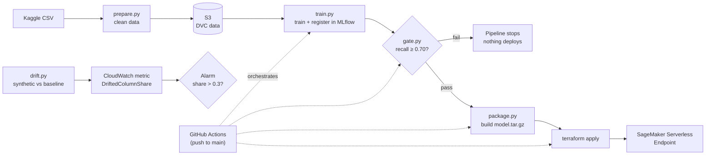

# Customer Churn Prediction — AWS-Native MLOps Pipeline

An end-to-end MLOps pipeline for predicting telecom customer churn: data versioning, experiment
tracking, infrastructure as code, automated CI/CD with a real quality gate, and production
monitoring, all on AWS.

## Architecture



Solid arrows show the data/model flow. Dashed arrows show what GitHub Actions automates end to
end on every push. Drift monitoring runs independently — see [Monitoring](#monitoring).

## Tech stack

| Layer                  | Tool                                        |
|-------------------------|----------------------------------------------|
| Data versioning          | DVC (S3 remote)                              |
| Experiment tracking      | MLflow (tracking + model registry)           |
| Model                    | scikit-learn                                 |
| Training / deployment    | AWS SageMaker                                |
| Infrastructure as code   | Terraform                                    |
| CI/CD                    | GitHub Actions (train → validate → deploy)   |
| Drift monitoring         | Evidently AI + CloudWatch alarm              |

## Repo structure

```
.
├── .github/workflows/    # CI/CD pipeline
├── config/               # hyperparameters, quality gate threshold
├── data/                 # DVC-tracked raw/processed data (not in git)
├── docs/                 # supporting write-ups
├── notebooks/            # exploratory analysis, not part of the pipeline
├── scripts/              # data download
├── src/churn/
│   ├── data/              # cleaning
│   ├── training/           # training, evaluation, quality gate
│   ├── inference/            # SageMaker inference entry point, packaging
│   └── monitoring/            # drift detection
├── terraform/
│   ├── backend.tf             # remote state
│   ├── s3.tf                   # data bucket
│   ├── iam.tf                   # SageMaker execution role
│   ├── iam_ci.tf                  # CI identity and policy
│   ├── sagemaker.tf                # model, endpoint config, endpoint
│   └── monitoring.tf                # drift alarm
├── Makefile
└── requirements*.txt
```

## Setup

Requires Python 3.11.

```bash
make setup      # creates .venv, installs dependencies, installs the package in editable mode
```

Copy `.env.example` to `.env` and fill in AWS and Kaggle credentials before running data or
training steps.

## Data

The dataset is the [Telco Customer Churn](https://www.kaggle.com/datasets/blastchar/telco-customer-churn)
dataset from Kaggle, versioned with DVC against an S3 remote provisioned by Terraform.

```bash
cd terraform && terraform init && terraform apply   # provisions the S3 bucket

make download-data    # pulls the raw CSV from Kaggle
make prepare-data     # cleans it: drops customerID, fixes TotalCharges, encodes the target

dvc add data/raw/WA_Fn-UseC_-Telco-Customer-Churn.csv data/processed/telco_churn_clean.csv
dvc remote add -d storage s3://<dvc-bucket-name>/dvc-store
dvc push
```

The dataset is about 26.6% churn — imbalanced enough that evaluation leads with precision,
recall, and ROC-AUC rather than raw accuracy.

## Training

```bash
make train        # trains all candidates, logs to MLflow, registers the best
make mlflow-ui     # inspect runs and models at http://127.0.0.1:5001
```

[train.py](src/churn/training/train.py) trains every candidate defined in
[train_config.yaml](config/train_config.yaml) — currently logistic regression and random forest,
both weighted to account for class imbalance — logs parameters, metrics, and the model artifact
for each as its own MLflow run, then registers the candidate with the best ROC-AUC as
`churn-classifier` in the MLflow Model Registry under a `champion` alias.

Tracking uses a SQLite backend rather than MLflow's plain file store, since the Model Registry
requires a database-backed store. Because CI runs on fresh, ephemeral machines, the tracking
database is synced through the same S3 bucket used for data versioning — pulled before training
and pushed back after — so registry history and version numbers stay continuous across local and
CI runs instead of resetting on every pipeline execution.

```bash
make mlflow-pull   # bring CI's training history into your local UI
make mlflow-push   # publish a local run to the shared history
```

This isn't automatic on every `make train`, since most local runs are exploratory. Note that this
approach doesn't provide concurrent-write safety; it's appropriate for a single-operator project,
not a multi-writer production setup, which would call for a dedicated MLflow tracking server.

## Deploy

```bash
make package-model                                  # exports the MLflow champion to build/model.tar.gz
cd terraform && terraform init && terraform apply    # uploads it and deploys the SageMaker endpoint
```

`make package-model` must run before `terraform apply`, since Terraform uploads whatever tarball
currently exists rather than building it.

Deployment uses [SageMaker Serverless Inference](https://docs.aws.amazon.com/sagemaker/latest/dg/serverless-endpoints.html)
rather than an always-on real-time endpoint, so there is no idle-hour billing while the endpoint
exists but receives no traffic. [inference.py](src/churn/inference/inference.py) implements the
four functions AWS's prebuilt scikit-learn container expects
(`model_fn`/`input_fn`/`predict_fn`/`output_fn`); [package.py](src/churn/inference/package.py)
exports the MLflow champion model, re-serializes it as `model.joblib`, and packages it with the
inference script — no additional runtime dependencies bundled.

Two constraints keep training and serving in lockstep:
- `requirements.txt` pins `scikit-learn==1.4.2`, the newest version supported by AWS's prebuilt
  SageMaker scikit-learn container. Models pickled with a newer scikit-learn aren't guaranteed to
  unpickle correctly against an older one.
- The container doesn't include pandas. Rather than add it as a runtime dependency, the model's
  `ColumnTransformer` selects features by position rather than by name, so `inference.py` builds
  a plain Python list from the incoming JSON request in a fixed column order
  (`FEATURE_COLUMNS`, matching the processed dataset's schema) instead of constructing a
  DataFrame.

Test a deployed endpoint:

```bash
cat > /tmp/payload.json <<'EOF'
{"gender":"Female","SeniorCitizen":0,"Partner":"Yes","Dependents":"No","tenure":1,"PhoneService":"No","MultipleLines":"No phone service","InternetService":"DSL","OnlineSecurity":"No","OnlineBackup":"Yes","DeviceProtection":"No","TechSupport":"No","StreamingTV":"No","StreamingMovies":"No","Contract":"Month-to-month","PaperlessBilling":"Yes","PaymentMethod":"Electronic check","MonthlyCharges":29.85,"TotalCharges":29.85}
EOF

aws sagemaker-runtime invoke-endpoint \
  --endpoint-name "$(terraform output -raw sagemaker_endpoint_name)" \
  --content-type application/json \
  --cli-binary-format raw-in-base64-out \
  --body file:///tmp/payload.json \
  /tmp/response.json && cat /tmp/response.json
```

`--cli-binary-format raw-in-base64-out` is required with AWS CLI v2, which treats binary
parameters as base64-encoded by default.

The IAM execution role ([iam.tf](terraform/iam.tf)) is scoped to exactly what the endpoint
needs — read access to its model artifact prefix in S3 and permission to write its own
CloudWatch logs — rather than a broad managed policy.

## CI/CD

[train-validate-deploy.yml](.github/workflows/train-validate-deploy.yml) runs on every push to
`main` that touches the source code, config, versioned data, or infrastructure, plus on manual
trigger. A single job runs sequentially:

```
resolve data bucket → pull data → sync MLflow history →
train → quality gate → package → deploy
```

The [quality gate](src/churn/training/gate.py) checks the newly trained champion's recall against
a threshold defined in `train_config.yaml` and exits non-zero if it isn't met. GitHub Actions
stops the job on any failed step, so a failing gate blocks packaging and deployment without any
additional conditional logic.

The gate deliberately checks a different metric than model selection: ROC-AUC picks the best
candidate among those trained in a given run, while the gate's recall threshold decides whether
that candidate is good enough to ship. For churn prediction, missing an actual churner is costlier
than a false alarm, which is why the gate is built around recall specifically.

Two pieces of supporting infrastructure make this work:

- **Remote Terraform state.** A local state file is sufficient when only one machine runs
  `terraform apply`; once CI does too, both need a shared view of state. [backend.tf](terraform/backend.tf)
  configures an S3 backend pointing at a separate, stable bucket — not the data bucket, which is
  destroyed and recreated across teardown cycles.
- **A scoped CI identity.** [iam_ci.tf](terraform/iam_ci.tf) defines an IAM user with a managed
  policy limited to the specific S3 buckets, SageMaker execution role, and SageMaker resources
  this pipeline manages. Authentication uses a static access key stored as GitHub repository
  secrets.

## Monitoring

```bash
make check-drift   # compares a synthetic drifted sample against the training baseline
```

[drift.py](src/churn/monitoring/drift.py) uses [Evidently](https://www.evidentlyai.com/) to
compare incoming data against the training baseline. Since this project has no live production
traffic, the default mode generates a synthetically perturbed sample to demonstrate detection;
pointing `--current` at a real CSV compares against actual data instead. The share of drifted
columns is reported as a custom CloudWatch metric (`ChurnMLOps/DriftedColumnShare`), and
[monitoring.tf](terraform/monitoring.tf) defines an alarm that fires above a 30% threshold.

The check runs on demand rather than on a schedule, since there is no live traffic to justify a
fixed cadence.

## Design decisions

**SageMaker Serverless Inference over a real-time endpoint.** A real-time endpoint bills
continuously for as long as it exists, regardless of traffic — roughly $36/month for an
`ml.t2.medium` left running. Serverless Inference scales to zero and bills per invocation, at the
cost of cold-start latency on the first request after an idle period. For a project with
intermittent, low-volume traffic, that tradeoff favors serverless clearly.

**A shared SQLite tracking store over a standing MLflow server.** A dedicated tracking server
backed by Postgres is the standard production setup, but it requires an always-on service. Syncing
the SQLite tracking database through S3 — pulled before training, pushed back after, on both local
and CI runs — avoids that cost while keeping registry history continuous. The tradeoff is no
concurrent-write safety, acceptable for a single-operator project but not for a team.

**Position-based feature selection over bundling pandas into the serving container.** AWS's
prebuilt SageMaker scikit-learn container doesn't include pandas, and its mechanism for installing
additional dependencies at runtime is unreliable for custom inference scripts. Rather than work
around that, the model's preprocessing selects columns by position instead of by name, so the
inference script never needs pandas or a DataFrame at all — one fewer dependency in the serving
path.

## Cost & cleanup

```bash
make destroy
```

Tears down everything Terraform manages: the SageMaker endpoint, endpoint configuration, and
model; the SageMaker execution role; the CI IAM user and policy; the data bucket; and the drift
alarm.

The Terraform state bucket is intentionally excluded, since it needs to persist across
destroy/rebuild cycles of everything else. It holds only a small state file and costs
effectively nothing to leave in place. To remove it as well:

```bash
aws s3 rb "s3://mlops-tfstate-$(aws sts get-caller-identity --query Account --output text)" --force
```

Ongoing cost while deployed but idle is effectively zero: the serverless endpoint doesn't bill
per hour, and S3 storage for this project's data and state amounts to fractions of a cent.

## License

MIT
