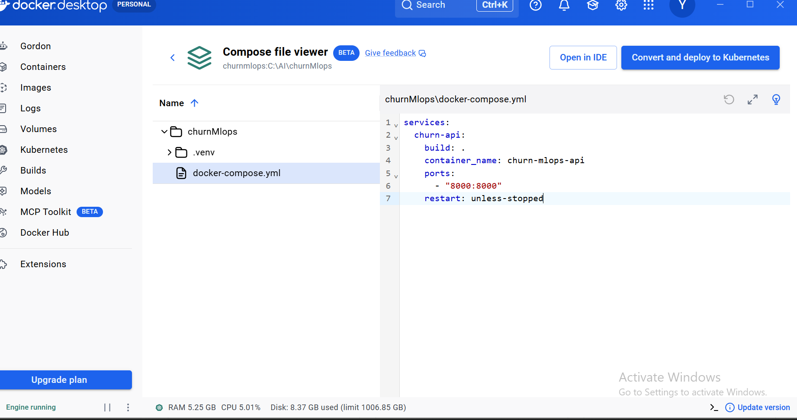
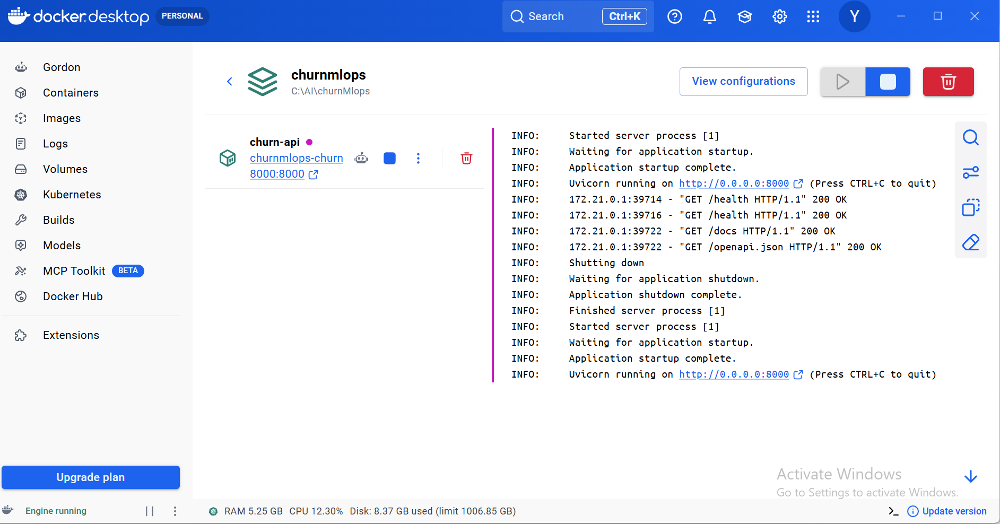

# Customer Churn Prediction — End-to-End MLOps Pipeline

A production-inspired machine learning and MLOps project for predicting customer churn using scikit-learn, MLflow, FastAPI, Docker, Docker Compose, Terraform, GitHub Actions, and drift monitoring.

The project covers the complete ML lifecycle from raw customer data and preprocessing through model training, experiment tracking, model validation, registry promotion, containerized inference, infrastructure as code, automated CI, and monitoring.

---

## Project Overview

Customer churn is a common business problem where organizations need to identify customers who are likely to discontinue their service.

This project builds an end-to-end churn prediction pipeline that:

- preprocesses customer data
- trains a machine learning model
- tracks experiments using MLflow
- validates model quality using a recall threshold
- promotes the approved model as the champion version
- exports the trained model for production inference
- serves predictions through FastAPI
- containerizes the service using Docker
- orchestrates deployment using Docker Compose
- manages container infrastructure using Terraform
- validates code and Docker builds using GitHub Actions
- detects synthetic feature drift

- ---

## Architecture

```text
Telco Customer Churn Dataset
↓
Data Preparation
↓
Feature Processing
↓
scikit-learn Training
↓
MLflow Tracking
↓
Model Registry
↓
Quality Gate
Recall >= 0.70
↓
Champion Model
↓
model.joblib
↓
FastAPI Inference
/health /predict
↓
Docker
↓
Docker Compose
↓
Terraform
↓
GitHub Actions CI
↓
Drift Monitoring
```

---

## Key Results

- Raw customer records: 7,043
- Cleaned records: 7,032
- Records removed due to missing TotalCharges: 11
- Churn rate: 26.6%
- Quality-gate threshold: Recall >= 0.70
- Achieved recall: 0.7968
- Champion model: Version 1
- Synthetic drift detected: 2 of 20 columns
- Drift rate: 10%
- FastAPI prediction endpoint successfully containerized with Docker

- ---

## Features

- Customer churn prediction
- Data preprocessing pipeline
- MLflow experiment tracking
- MLflow model registry
- Model quality gate
- Champion model promotion
- Model packaging
- FastAPI inference API
- Dockerized model serving
- Docker Compose orchestration
- Terraform infrastructure as code
- GitHub Actions CI pipeline
- Synthetic drift detection
- Automated testing
- Swagger/OpenAPI documentation

- ---

## Tech Stack

| Category | Technologies |
|---|---|
| Programming | Python |
| Data Processing | pandas |
| Machine Learning | scikit-learn |
| Model Persistence | joblib |
| Experiment Tracking | MLflow |
| Model Registry | MLflow Model Registry |
| Backend API | FastAPI |
| Validation | Pydantic |
| API Server | Uvicorn |
| Containers | Docker |
| Orchestration | Docker Compose |
| Infrastructure as Code | Terraform |
| CI/CD | GitHub Actions |
| Testing | PyTest |
| Monitoring | Synthetic Drift Detection |
| Version Control | Git, GitHub |

---

## Dataset

The project uses the Telco Customer Churn dataset.

The preprocessing pipeline:

- loads the raw customer data
- removes rows with missing TotalCharges
- prepares features for training
- preserves feature order for production inference
- outputs the cleaned dataset

- Processed output:

- ```text
Rows in: 7043
Rows out: 7032
Churn rate: 26.6%
```

---

## Model Training

The training pipeline uses scikit-learn and logs experiments to MLflow.

MLflow tracks:

- model parameters
- evaluation metrics
- model artifacts
- model versions
- experiment history

- ---

## Model Quality Gate

A production model should not automatically be promoted without validation.

This project implements a quality gate using recall:

```text
Required recall >= 0.70
Achieved recall = 0.7968
```

Result:

```text
PASS
```

The approved model is registered as the champion model.

---

## MLflow Model Registry

The trained model is tracked and promoted using MLflow Model Registry.

Champion model:

```text
churn-classifier@champion
```

The champion model is exported into:

```text
model.joblib
```

for lightweight containerized inference.

---

## FastAPI Inference API

The model is exposed through FastAPI.

### Health Endpoint

```http
GET /health
```

Example response:

```json
{
"status": "healthy",
"model": "churn-classifier-champion"
}
```

---

## Prediction Endpoint

```http
POST /predict
```

Example request:

```json
{
"gender": "Female",
"SeniorCitizen": 0,
"Partner": "No",
"Dependents": "No",
"tenure": 2,
"PhoneService": "Yes",
"MultipleLines": "No",
"InternetService": "Fiber optic",
"OnlineSecurity": "No",
"OnlineBackup": "No",
"DeviceProtection": "No",
"TechSupport": "No",
"StreamingTV": "Yes",
"StreamingMovies": "Yes",
"Contract": "Month-to-month",
"PaperlessBilling": "Yes",
"PaymentMethod": "Electronic check",
"MonthlyCharges": 95.5,
"TotalCharges": 190.5
}
```

Example response:

```json
{
"prediction": "Churn",
"churn_probability": 0.8861,
"model": "churn-classifier-champion"
}
```

---

## Docker

The inference service is packaged using Docker.

Build:

```bash
docker build -t churn-mlops-api .
```

Run:

```bash
docker run --rm -p 8000:8000 churn-mlops-api
```

Open:

```text
http://127.0.0.1:8000/docs
```

---

## Docker Compose

Run the containerized API using Docker Compose:

```bash
docker compose up --build
```

Stop:

```bash
docker compose down
```

---

## Terraform

Terraform manages the local Docker container as infrastructure as code.

Initialize:

```bash
terraform -chdir=terraform init
```

Validate:

```bash
terraform -chdir=terraform validate
```

Plan:

```bash
terraform -chdir=terraform plan
```

Apply:

```bash
terraform -chdir=terraform apply -auto-approve
```

Destroy:

```bash
terraform -chdir=terraform destroy -auto-approve
```

---

## GitHub Actions CI

The GitHub Actions workflow automatically performs:

```text
Git Push
↓
Checkout
↓
Python 3.11 Setup
↓
Dependency Installation
↓
PyTest
↓
Docker Image Build
```

Workflow:

```text
.github/workflows/ci.yml
```

---

## Drift Monitoring

The project includes synthetic drift detection.

Observed result:

```text
Drifted columns: 2
Total columns: 20
Drift rate: 10%
```

This demonstrates how production ML systems can monitor feature distribution changes over time.

---

## Project Structure

```text
customer-churn-mlops-pipeline/
│
├── src/
│   └── churn/
│       ├── api.py
│       ├── data/
│       ├── inference/
│       ├── monitoring/
│       └── training/
│
├── tests/
├── data/
├── terraform/
├── screenshots/
│
├── .github/
│   └── workflows/
│       └── ci.yml
│
├── Dockerfile
├── docker-compose.yml
├── requirements.txt
├── requirements-docker.txt
├── model.joblib
├── pyproject.toml
├── README.md
└── LICENSE
```

---

## Project Screenshots

### Docker Compose Configuration



### Dockerized FastAPI Service



---

## Demo Videos

- [Customer Churn MLOps Demo](screenshots/churn-mlops-demo.mp4)
- [FastAPI Inference Demo](screenshots/fastapi-inference-demo.mp4)
- [Swagger Prediction Demo](screenshots/swagger-predict-demo.mp4)

- ---

## Run Locally

### Clone

```bash
git clone https://github.com/gireeshvuyyuru501-design/customer-churn-mlops-pipeline.git
cd customer-churn-mlops-pipeline
```

### Create Environment

```bash
python -m venv .venv
```

Windows:

```powershell
.\.venv\Scripts\Activate.ps1
```

### Install Dependencies

```bash
pip install -r requirements.txt
```

### Run Tests

```bash
python -m pytest -v
```

### Start API

```bash
python -m uvicorn churn.api:app --reload --port 8000
```

Swagger:

```text
http://127.0.0.1:8000/docs
```

---

## Future Enhancements

- Cloud deployment
- Managed model registry
- Scheduled retraining
- Automated model promotion
- Live feature monitoring
- Alerting
- Model explainability
- Feature store integration
- Kubernetes deployment
- Production monitoring dashboard

- ---

## Author

Girish V

AI/ML Engineer | Generative AI | Agentic AI | MLOps | Python

GitHub:
https://github.com/gireeshvuyyuru501-design

LinkedIn:
https://www.linkedin.com/in/girish-genai-engineer

---

## License

This project is licensed under the MIT License.

See the [LICENSE](LICENSE) file for details.

---

## Project Summary

This project demonstrates a complete machine-learning lifecycle:

Data → Training → MLflow → Quality Gate → Model Registry → FastAPI → Docker → Terraform → GitHub Actions → Drift Monitoring

It showcases practical skills across Machine Learning, MLOps, API development, containerization, infrastructure as code, CI/CD, and model monitoring.

